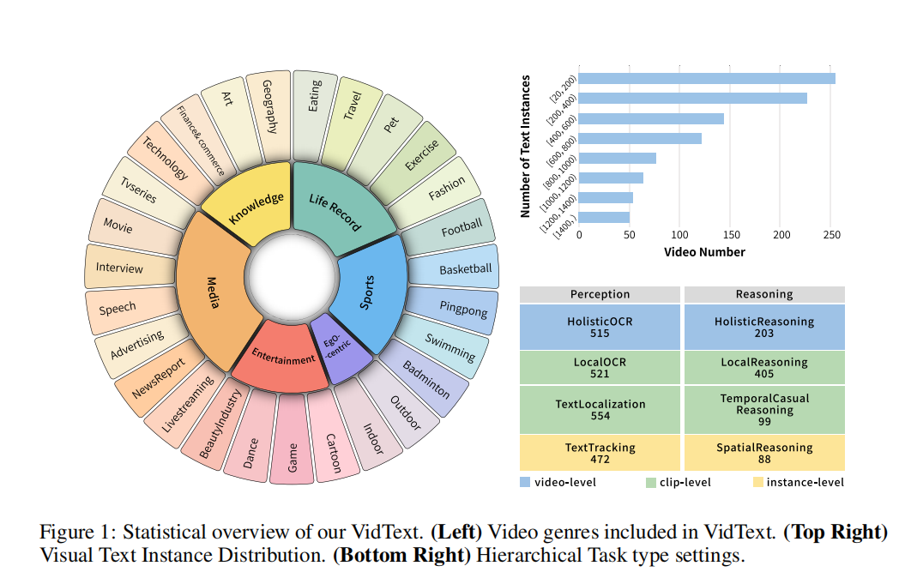
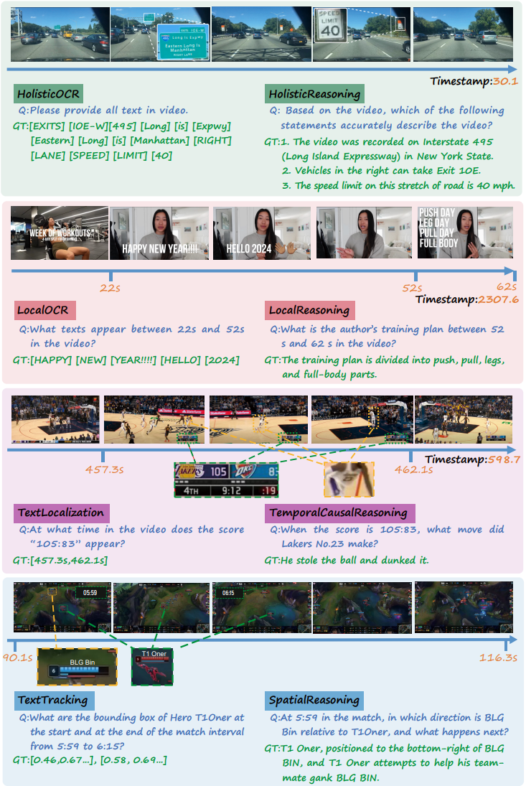

<h1 align="center">VidText: Towards Comprehensive Evaluation for Video Text Understanding</h1>
<p align="center">
  <!-- ArXiv Paper -->
  <a href="https://arxiv.org/abs/2505.22810">
    
  </a>
  <!-- HuggingFace Dataset -->
  <a href="https://huggingface.co/datasets/sy1998/VidText">
    
  </a>
  <!-- GitHub Repo -->
  <a href="https://github.com/shuyansy/VidText">
    
  </a>
</p>

This repo contains the annotation data, inference code, and evaluation tools for the paper  
“**VidText: Towards Comprehensive Evaluation for Video-Text Understanding**” &nbsp;([arXiv 2505.22810](https://arxiv.org/abs/2505.22810)).


## :bell: News:
- 🥳 5/30/2025: We have released the VidText [Benchmark](https://huggingface.co/datasets/sy1998/VidText) and [Paper](https://arxiv.org/abs/2505.22810)! :fire:

## License
Our dataset is under the CC-BY-NC-SA-4.0 license.

:warning: If you need to access and use our dataset, you must understand and agree: **This dataset is for research purposes only and cannot be used for any commercial or other purposes. The user assumes all effects arising from any other use and dissemination.**

We do not own the copyright of any raw video files. Currently, we provide video access to researchers under the condition of acknowledging the above license. For the video data used, we respect and acknowledge any copyrights of the video authors. Therefore, for the movies, TV series, documentaries, and cartoons used in the dataset, we have reduced the resolution, clipped the length, adjusted dimensions, etc. of the original videos to minimize the impact on the rights of the original works. 

If the original authors of the related works still believe that the videos should be removed, please contact authors or directly raise an issue.


## Introduction
We introduce VidText, a comprehensive benchmark designed explicitly for systematic evaluation of multimodal large language models (MLLMs) in dynamic video text understanding. VidText encompasses a diverse set of videos of varying lengths across 27 fine-grained genres, covering multiple languages and scenarios, and includes eight systematically designed tasks spanning both perception and reasoning dimensions. These tasks challenge MLLMs to leverage textual cues appearing dynamically within videos at various granularities—from holistic video-level understanding to fine-grained spatial-temporal grounding.

Our extensive evaluation of 18 state-of-the-art multimodal LLMs, including proprietary models such as Gemini-1.5 Pro,GPT-4o and prominent open-source models like VideoLLaMA-3,Qwen2.5-VL,InternVL2.5 reveals substantial difficulties in effectively utilizing textual information in video contexts. Even the highest-performing models achieve an average accuracy of merely 45.3% across tasks, underscoring significant limitations in current MLLMs' OCR integration, temporal grounding, and multi-step reasoning capabilities.

We anticipate that VidText will serve as a crucial catalyst for future research, driving improvements in multilingual text spotting, video-level reasoning, and the integration of visual and textual modalities, thereby substantially advancing the community's capabilities in comprehensive video-text understanding.




### The overall performance on VidText

| Method | Size | Avg. | HoliOCR | HoliRea. | LocalOCR | LocalRea. | TextLocal. | TempCauRea. | TextTrac. | SpaRea. |
|--------|------|------|---------|----------|----------|-----------|------------|-------------|-----------|---------|
| *Human* | -- | 89.5 | 92.8 | 96.0 | 94.3 | 95.7 | 81.3 | 88.6 | 80.3 | 87.3 |
| **Proprietary LMMs** | | | | | | | | | | |
| GPT-4-Turbo | -- | 29.7 | 22.9 | 28.7 | 36.7 | 36.5 | 15.8 | 39.4 | 24.3 | 33.6 |
| Gemini 1.5 Flash | -- | 34.7 | 26.3 | 34.0 | 40.2 | 42.4 | 28.9 | 40.0 | 30.7 | 35.4 |
| GPT-4o | -- | 40.2 | 29.5 | 38.9 | 46.0 | 43.3 | 45.5 | 42.5 | 36.2 | 39.8 |
| Gemini 1.5 Pro | -- | **45.3** | **34.8** | **43.6** | **50.2** | **50.1** | **48.7** | **47.0** | **40.3** | **47.9** |
| **Open-source LMMs** 
| LongVU | 3B | 17.0 | 5.8 | 20.4 | 15.4 | 17.0 | 15.6 | 15.9 | 15.4 | 30.5 |
| Qwen2.5-VL (3B) | 3B | 21.1 | 11.4 | 23.2 | 28.5 | 17.8 | 18.7 | 15.4 | 18.3 | 35.3 |
| Video-XL-Pro | 3B | 22.5 | 10.9 | 22.9 | 30.4 | 15.6 | 18.7 | 27.9 | 20.9 | 32.9 |
| LongVA | 7B | 19.2 | 4.8 | 5.6 | 3.2 | 46.9 | 4.5 | 28.3 | 29.6 | 30.5 |
| MiniCPM-V2.6 | 7B | 26.5 | 29.2 | 21.2 | 11.4 | 42.9 | 13.3 | 30.3 | 20.5 | 43.2 |
| VideoChatFlash | 7B | 29.2 | 13.6 | 13.3 | 1.0 | 50.1 | 45.1 | 42.4 | 23.3 | 44.3 |
| Qwen2-VL (7B) | 7B | 30.3 | 27.0 | 34.0 | 37.5 | 23.7 | 11.2 | 42.4 | 24.6 | 42.1 |
| Qwen2.5-VL (7B) | 7B | 31.9 | 35.9 | 36.0 | 37.0 | 26.5 | 26.5 | 35.4 | 22.4 | 35.2 |
| VideoLLaMA3 | 7B | **39.9** | 23.5 | 31.5 | 39.2 | 41.2 | **47.3** | **55.6** | 31.1 | 50.0 |
| ShareGPT4Video | 8B | 16.4 | 2.5 | 2.6 | 0.8 | 43.5 | 0.0 | 27.3 | 28.0 | 26.1 |
| Oryx-1.5 | 32B | 35.4 | 35.3 | 33.9 | 30.8 | 48.5 | 26.7 | 45.2 | 26.0 | 36.4 |
| LLava-OV | 72B | 36.1 | 20.1 | 28.1 | **41.3** | 49.4 | 9.9 | 54.6 | **31.8** | **53.4** |
| Qwen2.5-VL (72B) | 72B | 38.5 | 40.1 | **49.3** | 35.9 | 28.2 | 28.7 | 52.5 | 31.1 | 42.1 |
| InternVL2.5 | 78B | 39.8 | **40.2** | 37.4 | 29.0 | **50.4** | 30.5 | 48.5 | 29.9 | 52.3 |


## VidText Benchmark
> Before you access our dataset, we kindly ask you to thoroughly read and understand the license outlined above. If you cannot agree to these terms, we request that you refrain from downloading our video data.


The annotation file is readily accessible [here]([https://github.com/shuyansy/VidText/data](https://github.com/Naxyang/VidText/tree/master/data)). For the raw videos, you can access them via this [<u>🤗 HF Link</u>](https://huggingface.co/datasets/sy1998/VidText).


VidText includes 8 tasks spanning holistic and local OCR, text grounding, and multimodal reasoning, to comprehensively evaluate video-level, clip-level, and instance-level video text understanding.Examples of the tasks are displayed below.




## Evaluation
Please refer to our [evaluation](https://github.com/shuyansy/VidText/data/evaluation) folder for more details.


## Hosting and Maintenance
The annotation files will be permanently retained. 

If some videos are requested to be removed, we will replace them with a set of video frames sparsely sampled from the video and adjusted in resolution. Since **all the questions in VidText are only related to visual content** and do not involve audio, this will not significantly affect the validity of VidText (most existing MLLMs also understand videos by frame extraction).

If even retaining the frame set is not allowed, we will still keep the relevant annotation files, and replace them with the meta-information of the video, or actively seek more reliable and risk-free video sources.


## Citation

If you find this repository useful, please consider giving a star :star: and citation

```

```


